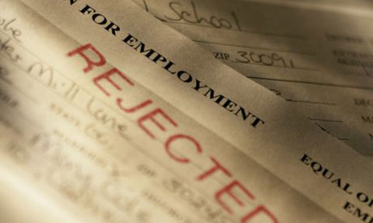

You go to high school, and graduate.   After graduating you decide to go to college.   In college you major in 'science', but after meeting too many minimum wage paid PhDs, you quickly decide to switch to a more lucrative major. You switch majors to liberal arts.   You learn cleaver phrases to help you get dates. After 4 years of college and multiple STDs you graduate and apply for a decent paying job which you think you get hired.   Don't kid yourself, of course you get rejected. This happens repeatedly until you get dejected and stop searching (removing yourself from the USA unemployment statics). Luckily your college degree perfectly qualifies you for a manager position at a Mcdonalds, inside of a Walmart!   
