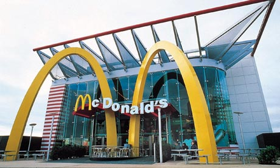

You go to high school, and graduate.   After graduating you decide to travel.   You move to Mexico.   You take your dad's old job which moved south and pays $3.00 a week until you become broke.   Unable to speak the native language, you dejectedly wander the streets until you see the familiar golden arches and your only beacon of hope. Luckily only visiting Americans eat here, so language is not a problem. You end up getting a job at McDonalds (lucky for you Walmart is boycotted here).   
